---
## **Scenario Scoring and Analysis**

This set of scenarios covers a broad range of user interactions, with a particular focus on query complexity as a key differentiator in assessing i2b2 usage proficiency. The scenarios demonstrate a distribution of use cases across the dimensions of the rubric, providing a scoreable assessment framework. 

### **Scoring Results Table:**

The following table presents the scores for each scenario according to the dimensions defined in the rubric. These scores are based on the detailed descriptions of each scenario and the criteria outlined in the rubric.

| Scenario                                                                                                          | Overall Score | i2b2 Platform Proficiency (20%) | Domain Expertise (20%) | Query Complexity (35%) | Data Integration & External Resources (10%) | Security, Privacy & Ethics (10%) | Collaboration (5%) |
| :---------------------------------------------------------------------------------------------------------------- | :------------ | :------------------------------ | :--------------------- | :--------------------- | :------------------------------------------ | :------------------------------- | :----------------- |
| [[#Scenario 1 Basic Cohort Identification (Novice)\|1. Basic Cohort Identification]]                              | 2.52          | 2.0                             | 4.6                    | 2.45                   | 1.0                                         | 3.4                              | 1.0                |
| [[#Scenario 2 Exploring Temporal Trends (Intermediate)\|2. Exploring Temporal Trends]]                            | 4.47          | 4.4                             | 5.0                    | 4.55                   | 2.3                                         | 5.0                              | 3.0                |
| [[#Scenario 3 Advanced Cohort Comparison (Advanced)\|3. Advanced Cohort Comparison]]                              | 6.89          | 6.8                             | 8.0                    | 7.35                   | 3.6                                         | 7.0                              | 6.6                |
| [[#Scenario 4 Integrating External Data (Expert)\|4. Integrating External Data]]                                  | 8.81          | 9.0                             | 9.0                    | 8.05                   | 9.7                                         | 9.0                              | 7.2                |
| [[#Scenario 5 Developing and Sharing Query Templates (Expert/Master)\|5. Developing and Sharing Query Templates]] | 8.55          | 9.6                             | 9.0                    | 7.7                    | 5.0                                         | 9.0                              | 8.6                |
| [[#Scenario 6 Troubleshooting a Complex Query (Intermediate/Advanced)\|6. Troubleshooting Complex Query]]         | 5.54          | 6.0                             | 5.0                    | 6.3                    | 2.6                                         | 6.0                              | 4.5                |
| [[#Scenario 7 Validating Data Quality with Ontology Expertise (Advanced/Expert)\|7. Validating Data Quality]]     | 7.46          | 8.2                             | 8.4                    | 5.95                   | 5.0                                         | 9.0                              | 7.1                |
| [[#Scenario 8 Onboarding a New Expert User (Novice)\|8. Onboarding a New Expert User]]                            | 4.33          | 1.0                             | 9.8                    | 2.45                   | 6.1                                         | 8.0                              | 2.2                |
|                                                                                                                   |               |                                 |                        |                        |                                             |                                  |                    |


---
# Scenario 1: Basic Cohort Identification (Novice)

---

* **User:** A clinical research coordinator new to i2b2 but with a solid understanding of their research domain.

* **Goal:** Identify a cohort of patients diagnosed with type 2 diabetes within the last year.

* **i2b2 Tools and Actions:**
    1. User accesses the i2b2 Web Client and navigates to the Query Tool.
    2. User consults i2b2 online documentation or seeks assistance from colleagues to understand how to find diagnosis codes within the ontology.
    3. User navigates the i2b2 ontology tree in the "Terms" panel, attempting to find the concept for "type 2 diabetes."
    4. User struggles to find the correct concept path, potentially searching for variations of "type 2 diabetes" or browsing through different branches of the ontology.
    5. User eventually locates the concept path: 
	    `\\rpdr\RPDR\Diagnoses\Endocrine, nutritional and metabolic diseases (240-279)\Diabetes mellitus (250)\Type 2 Diabetes`.
    6. User drags and drops the "Type 2 Diabetes" term into a new query group in the Query Tool.
    7. User consults i2b2 documentation to understand how to specify a date range for the diagnosis.
    8. User adds a date range constraint to the query group, specifying "within the last year." This is done by selecting the option to constrain by date, choosing the "diagnosis date" from the options, and then entering the appropriate date range in the provided interface.
    9. User names the query "Type 2 Diabetes - Last Year."
    10. User clicks the "Run Query" button in the Query Tool.
    11. The i2b2 Web Client sends a request to the CRC cell to execute the query, specifying `PATIENT_COUNT_XML` as the desired output format.
    12. The CRC cell executes the query and returns the patient count.
    13. The patient count is displayed in the results panel of the i2b2 Web Client interface.
    14. The user may choose to save the query in the "Previous Queries" panel for future use by clicking the "Save Query" button, providing a name via the Query Tool interface, and clicking "OK".

* **Collaboration:** The user may consult i2b2 online documentation or seek assistance from colleagues to understand basic functionalities.

* **Challenges:** Learning the i2b2 interface, understanding the structure of the ontology, finding the correct diagnosis codes, and specifying date ranges.

* **Expertise:** Novice i2b2 user, Intermediate domain expertise, limited collaboration.

---
### **Workflow Diagram:**

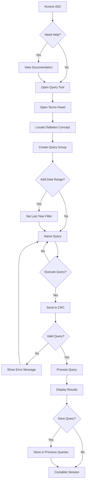


---
### **Dataflow Diagram:**

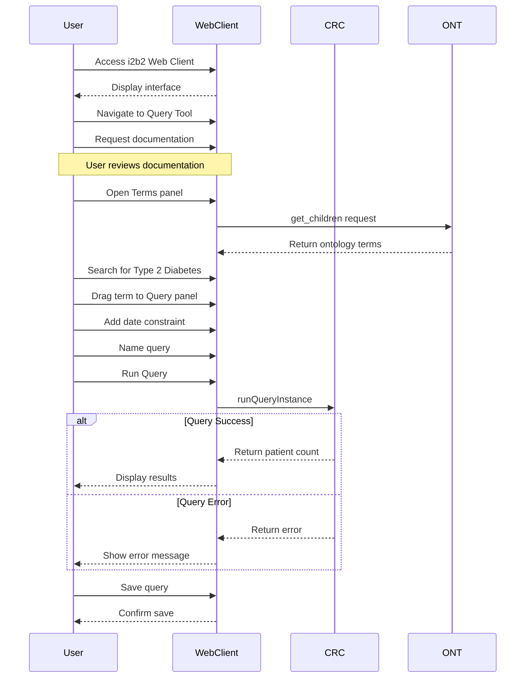


---
# Scenario 2: Exploring Temporal Trends (Intermediate)

---

* **User:** A researcher with some i2b2 experience.

* **Goal:** Analyze the trend of HbA1c levels over the past 5 years for patients with diabetes, specifically looking for clinically significant improvements or worsening after a particular intervention.

* **i2b2 Tools and Actions:**
    1. User accesses the i2b2 Web Client and navigates to the Query Tool.
    2. User consults i2b2 documentation or online resources to understand how to construct temporal queries and define specific lab value thresholds.
    3. User navigates the i2b2 ontology in the "Terms" panel, attempting to find the concept paths for "diabetes", "HbA1c lab results", and the specified intervention.
    4. User may need to consult external resources or domain experts to determine appropriate thresholds for "clinically significant" HbA1c changes.
    5. User drags and drops the relevant concept paths into the Query Tool panel to create query groups.
    6. User manually constructs a query using multiple criteria, including diagnosis codes, lab result codes, and potentially medication or procedure codes related to the intervention, applying the identified concept paths.
    7. User defines the temporal constraints, specifying that they want to analyze HbA1c levels over the past 5 years, using date range functions.
    8. User adds constraints to the query to define "clinically significant improvements or worsening" based on the numerical criteria determined in step 4.
    9. User names the query.
    10. User clicks the "Run Query" button in the Query Tool.
    11. The i2b2 Web Client sends a request to the CRC cell to execute the query, specifying an appropriate output format for trend analysis (e.g., a format that includes patient ID, HbA1c values, and dates).
    12. The CRC cell executes the query and returns the results.
    13. The results are displayed in a results panel of the i2b2 Web Client interface.
    14. The user exports the results to a data analysis tool (e.g., Excel, R) to visualize the trend.
    15. The user saves the query in the "Previous Queries" panel for future use.

* **Collaboration:** May consult with colleagues to determine the best way to structure the temporal query or to interpret the results. May reuse parts of an existing query from a previous project if available.

* **Challenges:** Constructing a query with temporal constraints, handling missing data, defining "clinically significant" change, and visualizing the trend effectively.

* **Expertise:** Intermediate i2b2 user, Intermediate domain expertise, basic collaboration and query reuse.

---
### **Workflow Diagram:**

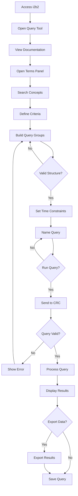


---
### **Dataflow Diagram:**

```mermaid
    sequenceDiagram
    participant User
    participant WebClient
    participant CRC
    participant ONT
    
    User->>WebClient: Access i2b2 Web Client
    WebClient-->>User: Display interface
    
    Note over User,WebClient: Documentation Phase
    User->>WebClient: Open Query Tool
    User->>WebClient: Request temporal query docs
    WebClient-->>User: Display documentation
    
    Note over User,WebClient: Query Construction
    User->>WebClient: Open Terms panel
    WebClient->>ONT: get_children request
    ONT-->>WebClient: Return ontology terms
    
    User->>WebClient: Search for concepts
    Note right of WebClient: Diabetes, HbA1c, Interventions
    
    User->>WebClient: Define change criteria
    User->>WebClient: Build query structure
    User->>WebClient: Set temporal constraints
    User->>WebClient: Name query
    
    Note over WebClient,CRC: Query Execution
    User->>WebClient: Execute query
    WebClient->>CRC: runQueryInstance
    
    alt Query Valid
        CRC-->>WebClient: Return results
        WebClient-->>User: Display results
        
        opt Export Results
            User->>WebClient: Request export
            WebClient-->>User: Provide data export
        end
        
        User->>WebClient: Save query
        WebClient-->>User: Confirm save
        
    else Query Error
        CRC-->>WebClient: Return error
        WebClient-->>User: Display error message
        Note over User,WebClient: Return to query construction
    end
 ```


---
# Scenario 3: Advanced Cohort Comparison (Advanced)

---

* **User:** An epidemiologist with extensive i2b2 experience conducting a comparative study.

* **Goal:** Compare two cohorts of patients with heart failure, one receiving a new medication (Drug A) and one receiving standard care (Drug B), in terms of hospital readmission rates within 6 months of discharge.

* **i2b2 Tools and Actions:**
    1. User accesses the i2b2 Web Client and navigates to the Query Tool.
    2. User consults i2b2 documentation, online resources, or colleagues to determine the best strategy for defining the cohorts and constructing the complex query.
    3. User navigates the i2b2 ontology in the "Terms" panel, locating concept paths for heart failure, hospital readmission, and potentially relevant diagnosis, medication, and procedure codes.
    4. User identifies appropriate diagnosis codes (e.g., ICD-10 codes for heart failure), medication codes (e.g., RxNorm codes for Drug A and standard care medications), and procedure codes (if necessary) to define the cohorts.
    5. User creates two separate query groups in the Query Tool, one for each cohort (Drug A and standard care).
    6. User drags and drops relevant terms from the ontology into each query group to define the inclusion criteria for each cohort (heart failure diagnosis, medication codes).
    7. User defines exclusion criteria (e.g., no prior history of kidney disease) by using the appropriate features in the Query Tool, potentially using nested queries or additional query panels.
    8. User carefully defines date ranges and temporal constraints to specify the exposure period (medication start date) and the outcome period (readmission within 6 months) for each cohort, using date and time functions within the Query Tool.
    9. User names each query appropriately.
    10. User clicks the "Run Query" button to execute both queries.
    11. The i2b2 Web Client sends requests to the CRC cell to execute the queries.
    12. The CRC cell executes the queries and returns the results.
    13. The results (patient counts or patient sets for each cohort) are displayed in the i2b2 Web Client.
    14. The user exports the results to a statistical software package for further analysis and comparison of readmission rates.
    15. User saves the queries in the "Previous Queries" panel for future use or adaptation.

* **Collaboration:** May collaborate with other researchers to define the cohort criteria and interpret the results. Might adapt an existing query from a similar study as a starting point, after consulting with the original creator.

* **Challenges:** Defining precise cohort criteria, handling complex temporal relationships, controlling for confounding factors, and performing statistical analysis.

* **Expertise:** Advanced i2b2 user, Advanced domain expertise, moderate collaboration and query reuse.

---
### **Workflow Diagram:**

```mermaid
    graph TD
    A[Access i2b2] --> B[Open Query Tool]
    B --> C[Review Documentation]
    
    C --> D[Open Terms Panel]
    D --> E[Search Concepts]
    E --> F[Locate Required Terms]
    
    F --> G[Create Cohorts]
    G --> H[Define Drug A Group]
    G --> I[Define Standard Care]
    
    H & I --> J[Set Inclusion Criteria]
    J --> K[Set Exclusion Criteria]
    
    K --> L[Set Time Constraints]
    L --> M[Name Queries]
    
    M --> N{Validate Design?}
    N -->|No| J
    N -->|Yes| O[Run Queries]
    
    O --> P{Query Valid?}
    P -->|No| Q[Show Error]
    P -->|Yes| R[Process Results]
    Q --> J
    
    R --> S[Display Results]
    S --> T{Export Data?}
    T -->|Yes| U[Export for Analysis]
    T -->|No| V[Save Queries]
    U --> V
```

---
### **Dataflow Diagram:**

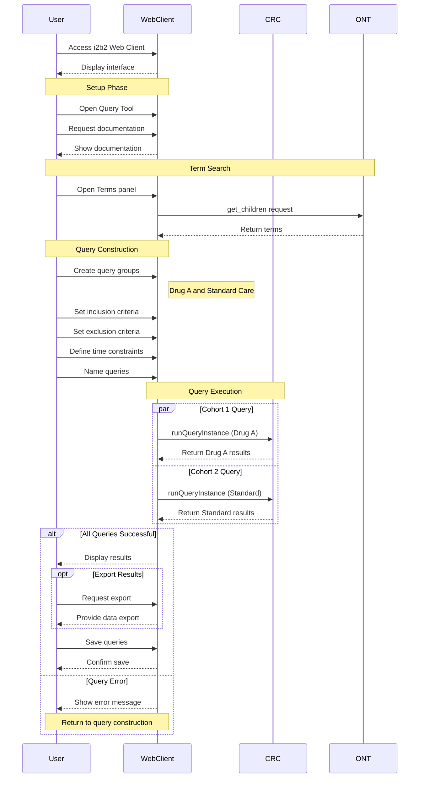

---
# Scenario 4: Integrating External Data (Expert)

---

* **User:** A researcher with expertise in i2b2 and external data integration.

* **Goal:** Investigate the correlation between a specific gene variant (found in an external genomic data file in VCF format) and the severity of asthma in a cohort of i2b2 patients.

* **i2b2 Tools and Actions:**
    1. User accesses the i2b2 Web Client and navigates to the Query Tool.
    2. User consults i2b2 documentation and potentially online resources or colleagues to understand how to integrate external data using the File Repository (FR) cell.
    3. User prepares the VCF file for upload, ensuring it meets the required format and contains the necessary patient identifiers for linking with i2b2 data.
    4. User uploads the VCF file to the FR cell using the `sendfile` service.
    5. User navigates the i2b2 ontology in the "Terms" panel, attempting to find the concept paths for "asthma" and potentially for "severity indicators."
    6. User may need to consult external resources or domain experts to determine the appropriate ontology terms for asthma severity.
    7. User manually constructs an i2b2 XML query to identify the cohort of patients with asthma, including severity indicators if available, using multiple criteria and potentially nested logic.
    8. User names the query.
    9. User clicks the "Run Query" button in the Query Tool to execute the query and identify the asthma cohort.
    10. User develops or adapts scripts (e.g., using Python or i2b2 APIs) to link patient identifiers in the i2b2 cohort with patient identifiers in the external genomic data file.
    11. User performs data harmonization to ensure consistent data formats and units between the i2b2 data and the VCF file. This may involve data cleaning, transformation, and quality control steps.
    12. User imports or links the relevant genomic data into the i2b2 environment or uses a separate analysis environment where the data can be joined.
    13. User performs statistical analysis to explore the correlation between the gene variant and asthma severity.
    14. User saves the query to the "Previous Queries" panel for potential future use or adaptation.

* **Collaboration:** May collaborate with bioinformaticians or data scientists to integrate and analyze the genomic data. May seek out and adapt existing scripts or workflows for data integration.

* **Challenges:** Understanding the process for uploading external data to i2b2, mapping identifiers between i2b2 and the external data source, managing data security and privacy, performing data transformations and integration, ensuring data quality and consistency, and conducting cross-platform analysis.

* **Expertise:** Expert i2b2 user, Advanced domain expertise, Advanced data integration skills, moderate collaboration and query adaptation.

---
### **Workflow Diagram:**

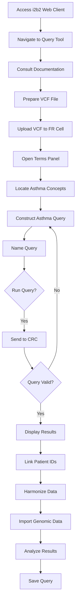

---
### **Dataflow Diagram:**

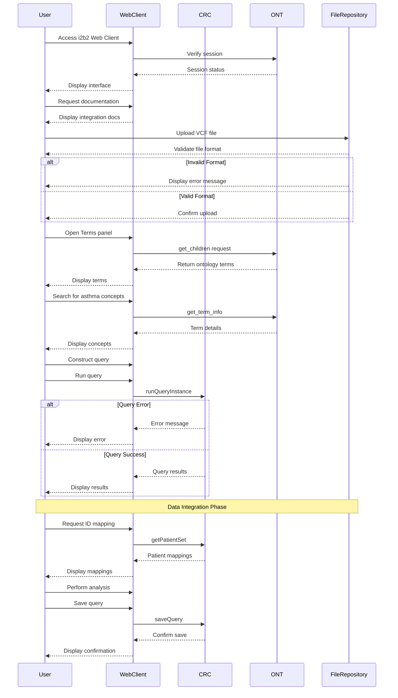


---
# Scenario 5: Developing and Sharing Query Templates (Expert/Master)

---

* **User:** An i2b2 power user/administrator with extensive experience in clinical trials and query development

* **Goal:** Create a reusable query template for determining patient eligibility for clinical trials related to a specific disease (e.g., Alzheimer's disease). The template should be well-documented, user-friendly, and easily adaptable to different trials within the same domain.

* **i2b2 Tools and Actions:**
    1. User accesses the i2b2 Web Client and navigates to the Query Tool.
    2. User consults i2b2 documentation, online resources, or colleagues to learn about best practices for creating and sharing query templates.
    3. User navigates the i2b2 ontology in the "Terms" panel, identifying relevant concept paths for Alzheimer's disease, related diagnoses, medications, lab tests, and demographic information.
    4. User manually constructs a complex i2b2 query in the Query Tool that captures common eligibility criteria for Alzheimer's disease trials. The user employs placeholders or variables where specific values might need to be adjusted by the end-user.
    5. User thoroughly documents the query template within the i2b2 environment (e.g., using comments within the query definition), explaining the rationale behind each criterion and providing clear instructions for customization.
    6. User tests and validates the template using a sample dataset to ensure its accuracy and effectiveness.
    7. User saves the query template in the "Previous Queries" panel, potentially using a specific naming convention to identify it as a template.
    8. User shares the query template with other researchers through the i2b2 shared query repository (if available), by exporting and sharing the query definition, or other collaborative platforms (e.g., a shared project within the i2b2 Workplace Cell).
    9. User leverages their own past queries and templates as a starting point for creating new templates.

* **Collaboration:** Actively seeks out and incorporates feedback from other researchers to improve the templates. Shares templates and provides support to users. Promotes best practices for query development and sharing within the i2b2 community. Also, maintains a well-organized personal library of queries, reusing and adapting them for different projects.

* **Challenges:** Designing a template that is both comprehensive and adaptable to different trials, ensuring the query is well-documented and easy to understand, promoting adoption of the template among other researchers, and balancing personal needs with community contributions.

* **Expertise:** Expert/Master i2b2 user, Expert domain expertise, Advanced collaboration skills, High level of personal query management proficiency.

---
### **Workflow Diagram:**

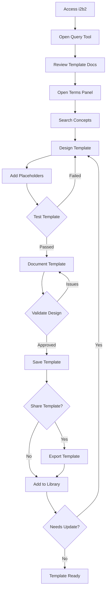


---
### **Dataflow Diagram**

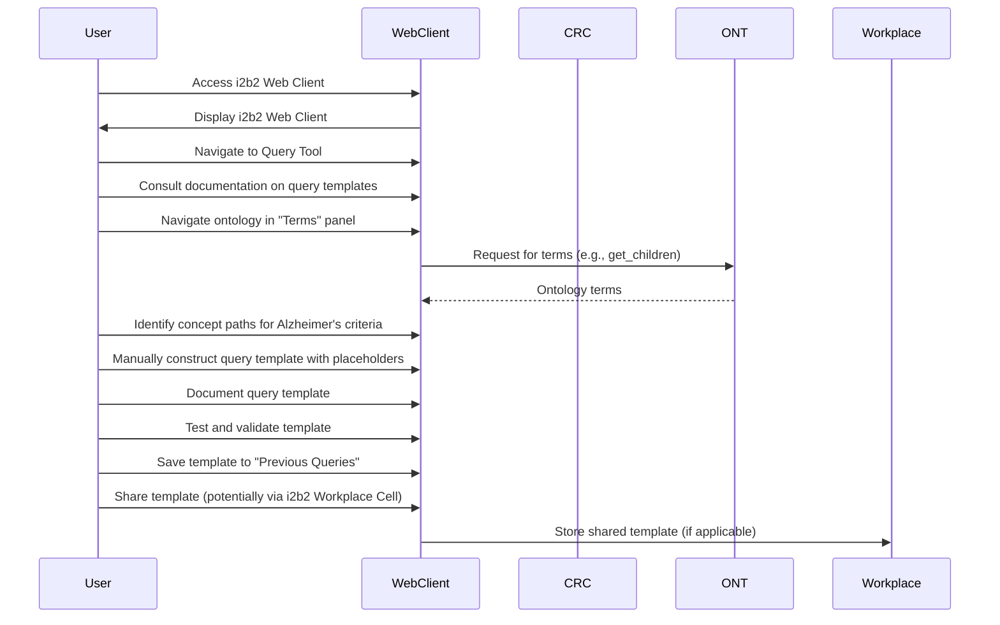


---
# Scenario 6: Troubleshooting a Complex Query (Intermediate/Advanced)

---

* **User:** A researcher with moderate to advanced i2b2 experience who is struggling with a complex query that is returning unexpected results or performing poorly.

* **Goal:** Identify and fix the errors in the query.

* **i2b2 Tools and Actions:**
    1. User accesses the i2b2 Web Client and navigates to the Query Tool.
    2. User loads the problematic query from the "Previous Queries" panel into the Query Tool.
    3. User examines the query logic, including the use of operators, parentheses, and date ranges.
    4. User breaks down the query into smaller parts to isolate the source of the error.
    5. User systematically tests each part of the query to identify the specific component causing the issue.
    6. User consults the i2b2 documentation or online resources for help with query syntax and optimization.
    7. May seek assistance from i2b2 support staff or experienced users.
    8. Compares their query to similar, validated queries to identify potential issues.
    9. Uses the i2b2 Query History panel to track different versions of the query and revert to previous versions if necessary.
    10. May try running the query with different result types or output options to gain further insights into the problem.
    11. User manually edits the query in the Query Tool to correct the errors.
    12. User re-runs the query to test the changes.
    13. User may need to repeat steps 3-12 iteratively until the query produces the expected results.

* **Collaboration:** Consults with colleagues or online forums to get help with debugging the query. May adapt troubleshooting strategies from previously successful queries.

* **Challenges:** Debugging complex query logic, understanding i2b2 error messages, and optimizing query performance.

* **Expertise:** Intermediate/Advanced i2b2 user, Intermediate/Advanced domain expertise, basic collaboration and query adaptation.

---
### **Workflow Diagram:**

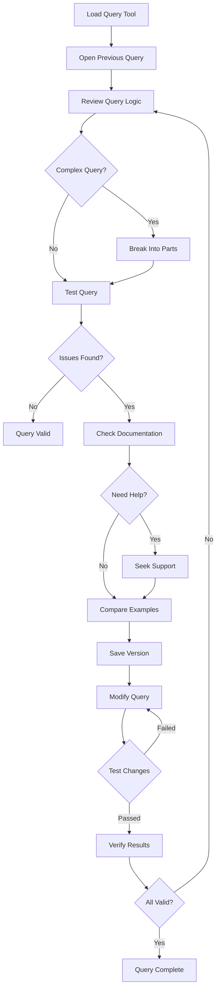


---
### **Dataflow Diagram:**

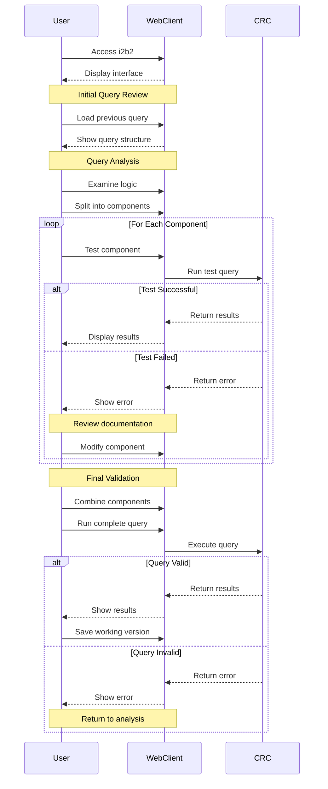


---

# Scenario 7: Validating Data Quality with Ontology Expertise (Advanced/Expert)

* **User:** A data analyst or informatician with expertise in data quality and medical terminologies.

* **Goal:** Assess the quality and consistency of data within a specific area of the i2b2 ontology (e.g., the accuracy and completeness of diagnosis coding for a particular disease).

* **i2b2 Tools and Actions:**
    1. User accesses the i2b2 Web Client and navigates to the Query Tool.
    2. User consults i2b2 documentation, online resources, or colleagues to learn about best practices for data quality assessment within i2b2.
    3. User navigates the i2b2 ontology in the "Terms" panel, identifying relevant concept paths for the specific disease or area of interest.
    4. User manually constructs complex i2b2 queries to identify potential data quality issues. This might involve queries to find:
        *   Missing codes: Patients with a condition but no corresponding diagnosis code.
        *   Inconsistent codes: Patients with the same condition coded in different ways.
        *   Invalid date ranges: Diagnoses or procedures recorded with dates outside the expected range.
        *   Unusual patterns: Unexpectedly high or low frequencies of certain codes.
    5. User may use external data profiling tools or scripts, in conjunction with i2b2, to examine the distribution and characteristics of the data (e.g., frequency analysis, value distributions, cross-tabulations).
    6. User leverages their knowledge of medical terminologies (e.g., ICD-10, SNOMED CT) and coding standards to interpret the query results and identify potential errors or inconsistencies.
    7. User meticulously documents their findings, including specific examples of data quality issues.
    8. User may compare data from different sources or time periods within i2b2 to assess consistency (if applicable).
    9. User generates reports summarizing the data quality assessment and providing recommendations for improvement.
    10. User saves their data quality assessment queries in the "Previous Queries" panel for future use or adaptation.

* **Collaboration:** Collaborates with data managers, clinicians, and domain experts to investigate and resolve data quality issues. Shares findings and recommendations with the i2b2 data management team. May seek out and adapt existing queries or scripts related to data quality assessment.

* **Challenges:** Identifying subtle data quality issues, understanding the nuances of medical coding, developing effective strategies for data quality improvement, and communicating findings to stakeholders.

* **Expertise:** Advanced/Expert i2b2 user, Expert domain expertise, data quality expertise, moderate collaboration.

---
### **Workflow Diagram:**

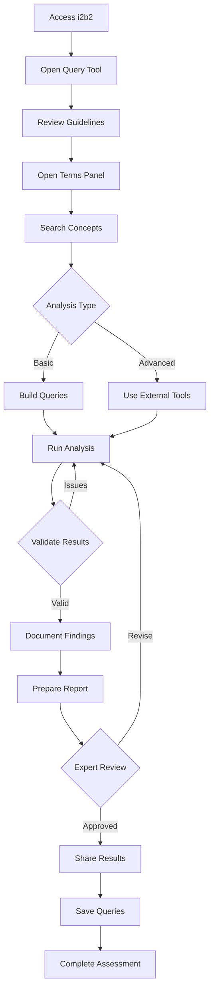

---
### **Dataflow Diagram:**

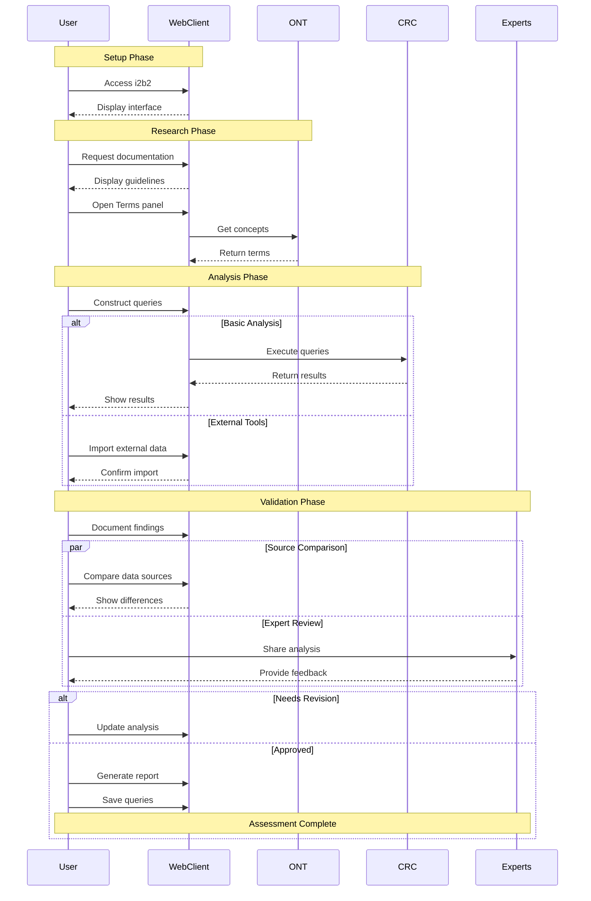


---
# Scenario 8: Onboarding a New Expert User (Novice)

---

* **User:** A world-renowned cardiologist with deep domain expertise but no prior i2b2 experience.

* **Goal:** Learn how to use i2b2 to identify and analyze patients with a specific rare cardiac condition for their research.

* **i2b2 Tools and Actions:**
    1. Receives training and support from experienced i2b2 users or trainers.
    2. Starts with simple queries and gradually progresses to more complex ones, guided by tutorials and documentation.
    3. Uses the i2b2 Query Tool's features to explore the ontology and learn about the available data.
    4. Consults the i2b2 documentation and online resources (e.g., community forums, tutorials).
    5. Seeks out and adapts existing queries related to their research area, with the help of more experienced users.

* **Collaboration:** Collaborates with other researchers and i2b2 experts to learn best practices and get assistance with query development.

* **Challenges:** Navigating the unfamiliar i2b2 interface, understanding the structure of the ontology, and learning how to formulate queries effectively.

* **Expertise:** Novice i2b2 user, Expert domain expertise, basic collaboration and query adaptation.

---
### **Workflow Diagram:**

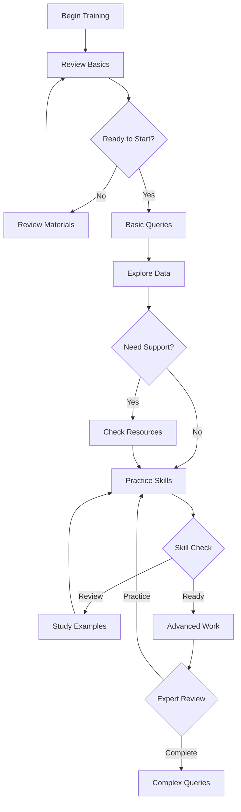

---
### **Dataflow Diagram:**

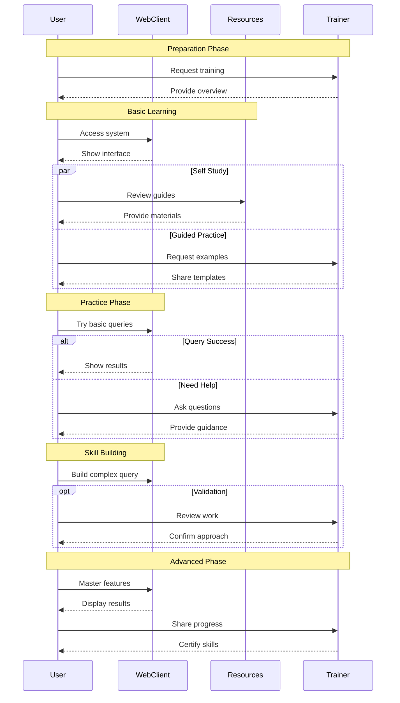


---
