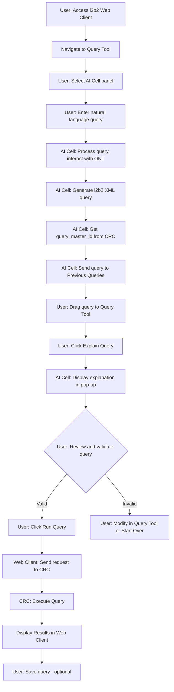
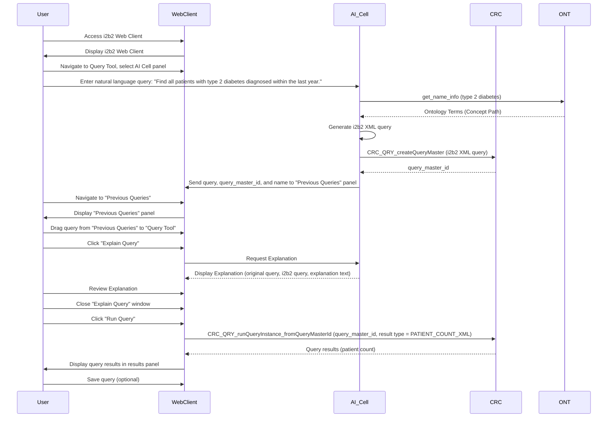

### **Scenario 1: Basic Cohort Identification (Novice) - With AI Assistance**

*   **User:** A clinical research coordinator new to i2b2 but with a solid understanding of their research domain.
*   **Goal:** Identify a cohort of patients diagnosed with type 2 diabetes within the last year.
*   **i2b2 Tools and Actions:**
    1.  **User Accesses i2b2:** The user accesses the i2b2 Web Client and navigates to the Query Tool.
    2.  **User Selects AI Cell:** The user selects the AI Cell panel within the Query Tool interface.
    3.  **User Enters Natural Language Query:** The user enters the following natural language query into the AI Cell panel's input box: "Find all patients with type 2 diabetes diagnosed within the last year."
    4.  **AI Cell Processes Query:**
        *   The AI Cell's NLP engine parses the natural language query.
        *   The AI Cell identifies "type 2 diabetes" as the key medical concept.
        *   The AI Cell interacts with the ONT cell using the `get_name_info` service to find matching i2b2 ontology terms.
        *   The AI Cell identifies the relevant concept path: `\\rpdr\RPDR\Diagnoses\Endocrine, nutritional and metabolic diseases (240-279)\Diabetes mellitus (250)\Type 2 Diabetes`.
        *   The AI Cell interprets "within the last year" as a date range constraint.
        *   The AI Cell constructs a valid i2b2 XML query definition, incorporating the concept path and the date range.
    5.  **AI Cell Gets Query Master ID:** The AI Cell sends a message to the CRC cell using the `CRC_QRY_createQueryMaster` service, including the XML query definition. The CRC cell generates a unique `query_master_id` and stores the query definition, then returns the `query_master_id` to the AI Cell.
    6.  **AI Cell Sends to Previous Queries:** The AI Cell sends the generated i2b2 query (in XML format) along with the `query_master_id` and a suggested query name (e.g., "AI: Type 2 Diabetes - Last Year") to the "Previous Queries" panel in the i2b2 Web Client.
    7.  **User Navigates to Previous Queries:** The user navigates to the "Previous Queries" panel.
    8.  **User Locates Query:** The user locates the newly generated query in the "Previous Queries" list.
    9. **User Drags and Drops:** The user drags and drops the query from the "Previous Queries" panel into a query group within the Query Tool panel.
    10. **User Clicks "Explain Query":** The user clicks the "Explain Query" button associated with the query (either in the "Previous Queries" panel or after dragging it to the Query Tool - the exact UI placement is TBD).
    11. **"Explain Query" Pop-up Appears:** A pop-up window appears, displaying:
        *   **Original Natural Language Query:** "Find all patients with type 2 diabetes diagnosed within the last year."
        *   **AI-Generated i2b2 Query:** (The XML query, potentially formatted for better readability).
        *   **Explanation:** "This query searches for patients with a diagnosis of Type 2 Diabetes. The i2b2 concept path for this is `\\rpdr\RPDR\Diagnoses\Endocrine, nutritional and metabolic diseases (240-279)\Diabetes mellitus (250)\Type 2 Diabetes`. The query also includes a date constraint to include only diagnoses within the last year."
    12. **User Reviews and Validates:** The user reviews the query and the explanation, confirming that it accurately reflects their intent.
    13. **User Closes Pop-up:** The user closes the "Explain Query" window.
    14. **User Initiates Execution:** The user clicks the "Run Query" button in the Query Tool.
    15. **Web Client Sends Request:** The i2b2 Web Client sends a request to the CRC cell to execute the query, using the `CRC_QRY_runQueryInstance_fromQueryMasterId` service, including the `query_master_id` and specifying `PATIENT_COUNT_XML` as the desired output format.
    16. **CRC Executes Query:** The CRC cell retrieves the query definition associated with the `query_master_id`, executes the query against the i2b2 data repository, and generates the patient count.
    17. **Results Displayed:** The patient count is displayed in the results panel of the i2b2 Web Client interface.
    18. **User Saves Query (Optional):** The user may choose to save the query (which is already in "Previous Queries") with a custom name.
*   **Collaboration:** The user might consult i2b2 documentation or seek assistance from colleagues, but the primary interaction is with the AI Cell.
*   **Challenges:**  The main challenge for the user is to formulate the initial natural language query clearly and to understand the explanation provided by the AI Cell.
*   **Expertise:** Novice i2b2 user, Intermediate domain expertise, limited collaboration.
*   **Error Handling:** If the AI Cell cannot process the natural language query (e.g., due to ambiguity or unrecognized terms), it provides an appropriate error message and potentially suggests alternative phrasing.

### **Workflow Diagram (with AI Cell):**

### **Dataflow Diagram (with AI Cell):**

